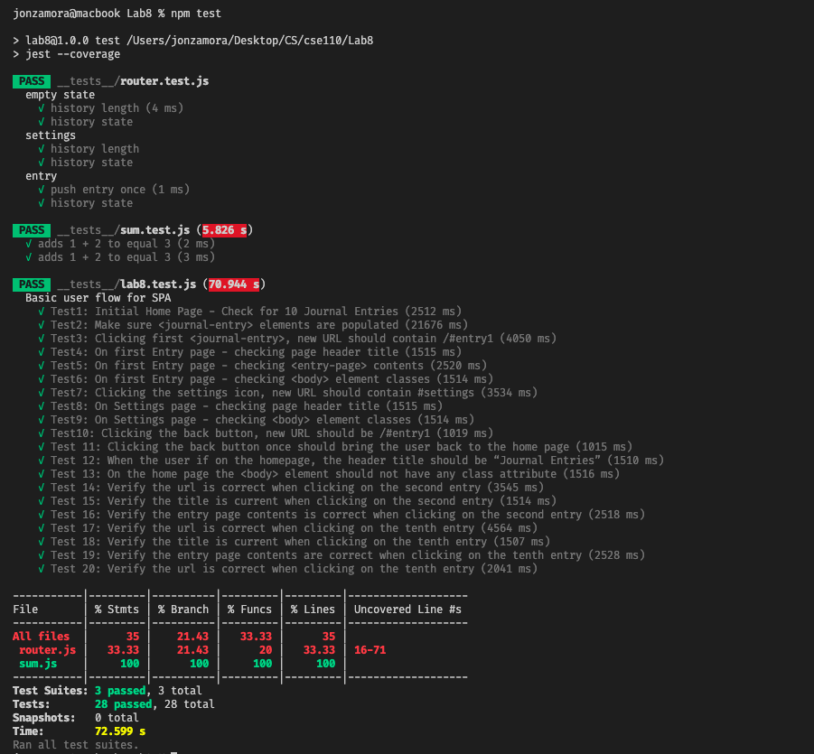

# Lab8_Starter
---
**Partners**: Jonathan Zamora-Anaya, Rahul Dadlani

---

## Check your understanding q's (FILL OUT)
1. In your own words: Where would you fit your automated tests in your Bujo project development pipeline? (just write the letter)

   - **`A`** `(1) Within a Github action that runs whenever code is pushed `

2. Would you use a unit test to test the “message” feature of a messaging application? Why or why not? For this question, assume the “message” feature allows a user to write and send a message to another user.

    - **`No`**`, I would not since the feature is more than a single unit of code. This feature is dependent on a number of other units of code like sending the message across a network, checking if the message was received, if the message received was correct etc.`

3. Would you use a unit test to test the “max message length” feature of a messaging application? Why or why not? For this question, assume the “max message length” feature prevents the user from typing more than 80 characters

    - **`Yes.`**`The max message length is a single unit of code and isn't dependent on other units of code.`

4. What do you expect to happen if we run our puppeteer tests with the field “headless” set to true?

    - `If we run our Puppeteer tests with the field 'headless' set to 'true', then a browser UI will not be shown while we run our tests. Instead, the tests will continue running in the background and the results for those tests will be reported after they have finished running.`

5. What would your beforeAll callback look like if you wanted to start from the settings page before every test case?

    - If we want to start from the settings page before every test case, we would add "await page.click('header > img');" after "await page.waitForTimeout(500);":
    ```js
    beforeAll(async () => {
        await page.goto('http://127.0.0.1:5500');
        await page.waitForTimeout(500);
        await page.click("header > img");
    });
    ```
---
## `npm test` Results
